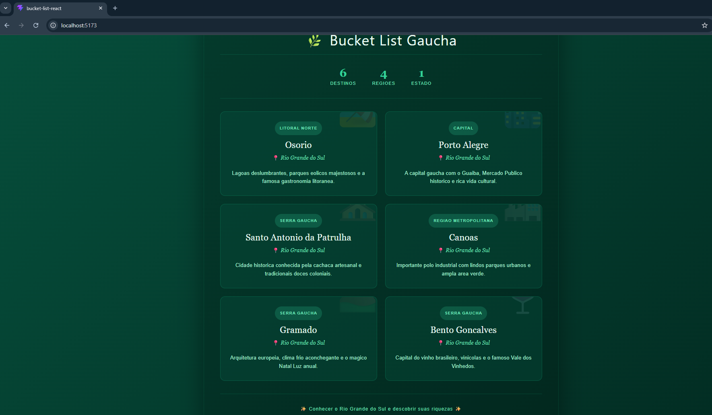

# 🌿 Atividade React - Bucket List Gaucha

Atividade Pratica 2 desenvolvida para a disciplina da faculdade, com foco em **criacao e utilizacao de componentes em React**.

## 📋 Sobre o Projeto

Aplicacao de Bucket List apresentando destinos para visitar no Rio Grande do Sul. 
A aplicacao foi desenvolvida com foco em **componentizacao**, dividindo a interface 
em multiplos componentes reutilizaveis e organizados.

## 🧩 Componentes Criados

A aplicacao foi estruturada em 5 componentes secundarios, todos importados e 
utilizados no componente principal `App.jsx`:

- **Cabecalho.jsx** - Cabecalho com titulo da aplicacao
- **Estatisticas.jsx** - Bloco com estatisticas (destinos, regioes, estado)
- **CardDestino.jsx** - Card individual de cada destino
- **ListaDestinos.jsx** - Container que renderiza todos os cards
- **Rodape.jsx** - Rodape com frase motivacional

Alem dos componentes, os dados foram separados em um arquivo proprio:
- **destinos.js** - Array com os dados dos destinos turisticos

## 📁 Estrutura de Pastas

## 🖼️ Print da Aplicacao



## 🚀 Tecnologias Utilizadas

- React
- Vite
- JavaScript (ES6+)
- Componentizacao com Props

## 💡 Conceitos Aplicados

- Criacao de componentes funcionais
- Importacao e exportacao de modulos (import/export)
- Comunicacao entre componentes via Props
- Renderizacao de listas com .map()
- Separacao de dados e apresentacao

## 💻 Como Executar o Projeto

```bash
npm install
npm run dev
```

---

Desenvolvido como atividade academica 🎓
